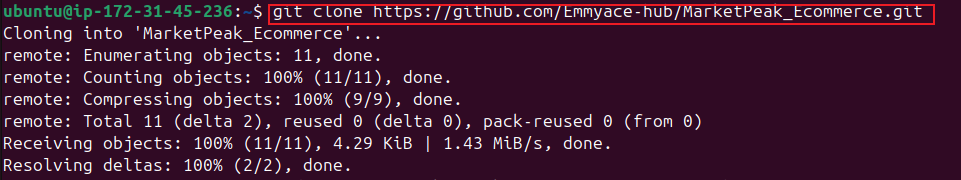

# E-commerce-platform-deployment
capstone project: ecommerce platform deployment with git.linux and aws

### Git Repository Initialization

## 1.1 create git repository name "MarketPeak_Ecommerce"

after which i created a new directory "mkdir MarketPeak_Ecommerce" and initialized the git repository to manage the version control as shown in the screenshots below:

## 1.2 Local website development

i created an html files for the hompage and named the folder MarketPeak as shown below

afterwhich i created html files for the homepage,about us and contact pages

## 1.3 Git commit
i staged the changes by adding and committing my changes to the repository 

after initializing my Github repository and adding the e-commerce website template i pushed the code to my Github repository and linked my local repository to Github using my terminal as shown below:

i pushed the local repsository content to Github :

### AWS Deployment

## 2.1 Setting up an AWS EC2 instance

i logged into the AWS management console , launched an EC2 instant "MarketPeak_Ecommerce" and allocated an ip to prevent it from disrupting my set up :

## 2.2 Cloned the repository on the linux server

using the ssh method i connected my EC2 to the ubuntu linux using the "key.pem" from myEC2 instance

afterwhich i  generated a SSH keypair using ssh-keygen on the EC2 instance

Displayed below is the generated public key which i added to my Github accouint as shown below:

i added the public key generated from the Linux server into the Github onlinerepository: 

i cloned the Git repsository on the **Ubuntu** Linux server:

## 2.3 Installing the Web Server on EC2
 I installed the Apache web server "Apachhe2" on the EC2 instance following the steps below:

## 2.4 Configuring the Apache for website
 i prepared the website directory  by clearing the default apache webb directory and copying the "MarketPeak_Ecommerce" website files to it as shown below:

after applying those changes i reloaded the Apache service

## 2.5 Accessing the website 
i was able to access the website using the public IP of the EC2 instance to view the deeployed website

## 3 Continious integration and Deploymennt
**Step 1** : created a Development branch to isolate the features abd bug fixes from the stable version of the website:

**Step 2** : Version control with Git
Using the git add ., commit and push command to stage the new changes and upload with the development branch to Github

**Step 3** : i created a pull request and merged into the main branch

**step4** : i tested the new changes  through a web browser by navigating to the EC2 instance and copying the public addrfess to the web browserand ii was able to confirm that the changes made worked successfully

